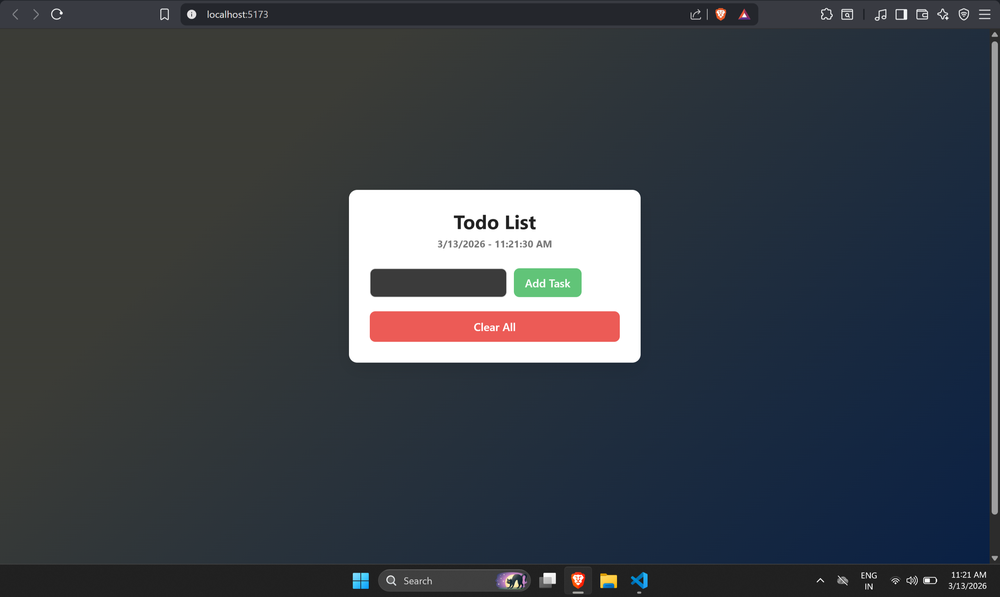

<h1 align="center">📝 Simple React Todo App</h1>

A clean and minimal Todo application built with React and Vite.

Add tasks • Mark them complete • Delete tasks • Persistent storage with localStorage

---

## 🌐 Live Demo

[Open the App](https://simple-todo-ten-rho.vercel.app)

---

## 📷 Preview

---

## ✨ Features

* ➕ Add new tasks
* ✅ Mark tasks as completed
* 🗑 Delete individual tasks
* 🧹 Clear all tasks instantly
* 💾 Persistent storage using localStorage
* 🎨 Clean UI with gradient background

---

## 🛠 Tech Stack

| Technology | Purpose                            |
| ---------- | ---------------------------------- |
| React      | UI components and state management |
| JavaScript | Application logic                  |
| CSS        | Styling and layout                 |
| Vite       | Fast development environment       |

---
